- **page layout vs component layouts**
  - page laoyts are the way we arrange components across aur entire page.
  - Component is a single entity where we have multiple html elements you can say nav bar is a component, footer is a component inside these components we are going to add multiple elements.
- Ways we can layouts

  - floats
  - flexbox 1d layouts
  - grid complete 2d layouts

- **Grid-Layout**

  - Check the contianer--1 css only grid-template-columns are specified and height is specified in el--1 element.

    - css

      ```
      .container--1 {
        font-family: sans-serif;
        background-color: rgb(164, 155, 155);
        font-size: 40px;
        margin: 40px;
        display: grid;
        grid-template-columns: 200px 200px 200px 200px;
      }

      .el--1 {
        background-color: #ff0000;
        margin: 5px;
        height: 150px;
      }

      .el--2 {
        background-color: #00ff00;
        margin: 5px;
      }

      .el--3 {
        background-color: #0000ff;
        margin: 5px;
      }

      .el--4 {
        background-color: #ffff00;
        margin: 5px;
      }

      .el--5 {
        background-color: #ff00ff;
        margin: 5px;
      }

      .el--6 {
        background-color: #00ffff;
        margin: 5px;
      }

      .el--7 {
        background-color: #ffa500;
        margin: 5px;
      }

      .el--8 {
        background-color: #800080;
        margin: 5px;
      }
      ```

      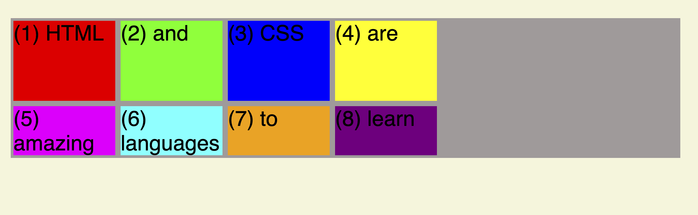

  - Check container--1 we have grid-template-columns and grid-template-rows check how we have give values to the grid-template-rows

    - css

      ```
      .container--1 {
        font-family: sans-serif;
        background-color: rgb(164, 155, 155);
        font-size: 40px;
        margin: 40px;
        display: grid;
        grid-template-columns: 200px 200px 200px 200px;
        grid-template-rows: 250px 200px;
      }

      .el--1 {
        background-color: #ff0000;
        margin: 5px;
        height: 150px;
      }

      .el--2 {
        background-color: #00ff00;
        margin: 5px;
      }

      .el--3 {
        background-color: #0000ff;
        margin: 5px;
      }

      .el--4 {
        background-color: #ffff00;
        margin: 5px;
      }

      .el--5 {
        background-color: #ff00ff;
        margin: 5px;
      }

      .el--6 {
        background-color: #00ffff;
        margin: 5px;
      }

      .el--7 {
        background-color: #ffa500;
        margin: 5px;
      }

      .el--8 {
        background-color: #800080;
        margin: 5px;
      }
      ```

      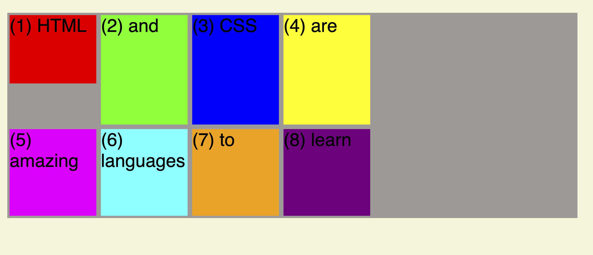

  - row-gap and coulmn-gap

    - css
      ```
      .container--1 {
        font-family: sans-serif;
        background-color: rgb(164, 155, 155);
        font-size: 40px;
        margin: 40px;
        display: grid;
        grid-template-columns: 200px 200px 200px 200px;
        grid-template-rows: 250px 200px;
        row-gap: 30px;
        column-gap: 30px;
        padding: 5px;
      }
      ```
      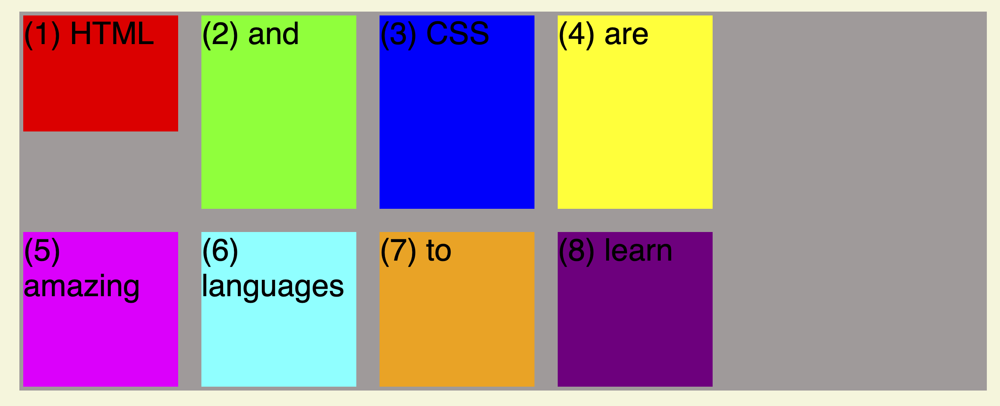

  - Grid-cell can/can not have any contents inside it we can have grid cell is called as the space created because of the intersection of grid-lines. Grid tracks are called as the entire collection of row and columns.
    - **Grid-Container** Properties
      - grid-template-rows: <track-size>
      - grid-template-columns: <track-size>
      - row-gap: 0 | <in pixels>
      - row-column: 0 | <in pixels>
      - To align items inside rows/columns **(horizontally or vertically)**
        - justify-items: strech | start | center | end
        - align-items: strech | start | center | end
      - To align **entire grid inside grid container**. This only applies if container is larger than the grid.
        - justify-content: strech | start | center | end
        - align-content: strech | start | center | end
    - **Gird-Items** Properties
      - To place a grid item into a specific cell based on line numbers. span can be used to span an item across more cell.
        - grid-column: <start line>/ <end line> | span <number>
        - grid-row: <start line>/ <end line> | span <number>
      - To overwrite justify-items/align-items for single items - justify-self: strech | start | center | end - align-self: strech | start | center | end
        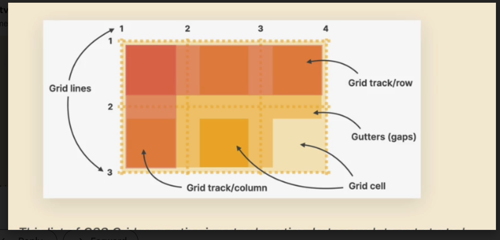
  - grid-template-rows/columns with **fr**

    - css
      grid-template-columns: 1fr 1fr 1fr 1fr === grid-template-columns: repeat(4, 1fr)

      ```
      .container--1 {
        font-family: sans-serif;
        background-color: rgb(164, 155, 155);
        font-size: 40px;
        margin: 40px;
        display: grid;
        /* grid-template-columns: 1fr 1fr 1fr 1fr; */
        grid-template-columns: repeat(4, 1fr);
        grid-template-rows: 1fr 1fr;
        row-gap: 30px;
        column-gap: 30px;
        padding: 5px;
      }

      .el--1 {
        background-color: #ff0000;
        height: 150px;
      }
      ```

      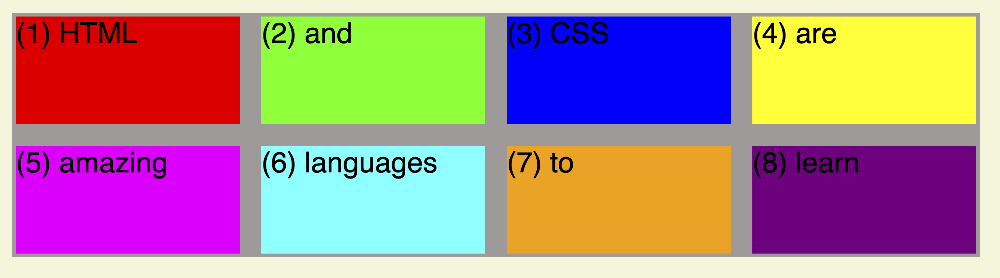

    - css **no height to container**
      ```
      .container--1 {
        font-family: sans-serif;
        background-color: rgb(164, 155, 155);
        font-size: 40px;
        margin: 40px;
        display: grid;
        grid-template-columns: repeat(4, 1fr);
        grid-template-rows: 1fr 1fr;
        row-gap: 30px;
        column-gap: 30px;
        padding: 5px;
      }
      ```
      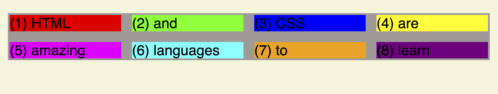
    - css **height to a container**
      ```
      .container--1 {
        font-family: sans-serif;
        background-color: rgb(164, 155, 155);
        font-size: 40px;
        margin: 40px;
        display: grid;
        grid-template-columns: repeat(4, 1fr);
        grid-template-rows: 1fr 1fr;
        row-gap: 30px;
        column-gap: 30px;
        padding: 5px;
        height: 500px;
      }
      ```
      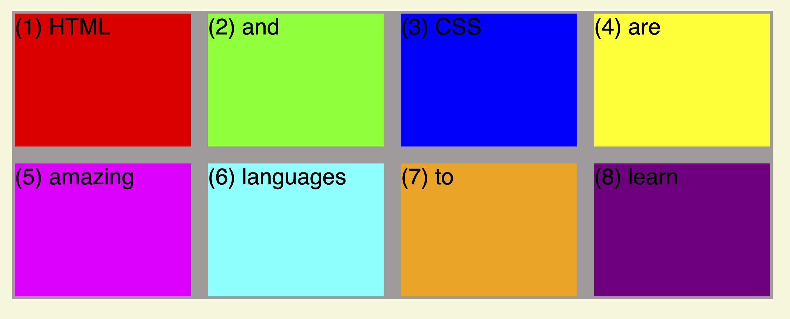
    - css **height to a container**

      ```
      .container--1 {
        font-family: sans-serif;
        background-color: rgb(164, 155, 155);
        font-size: 40px;
        margin: 40px;
        display: grid;
        grid-template-columns: repeat(4, 1fr);
        grid-template-rows: 1fr auto;
        row-gap: 30px;
        column-gap: 30px;
        padding: 5px;
        height: 500px;
      }
      ```

      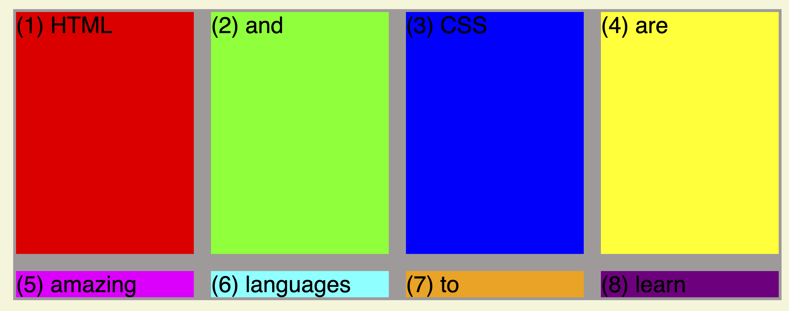

    - css **moving grid items in grid container**. Here moving 8th item to 1st position.
      ```
      .el--8 {
        background-color: #800080;
        grid-column: 1/2;
        grid-row: 1/2;
      }
      ```
      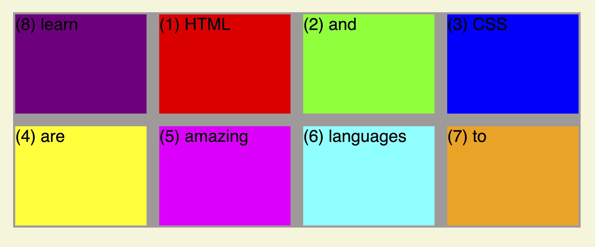
    - css spaning 8th grid item from 1 to 3 position.
      ```
      .el--8 {
        background-color: #800080;
        grid-column: 1/3;
        grid-row: 1/2;
      }
      ```
      
    - Justifying the content inside the grid container if the container is bigger than the actuall grid item contents.
      - css for moving grid items (whole) across **x-axis**<br>
      ```
      .container--2 {
        font-family: sans-serif;
        background-color: rgb(164, 155, 155);
        font-size: 40px;
        margin: 40px;
        display: grid;
        grid-template-columns: repeat(3, 100px);
        grid-template-rows: 250px 100px;
        row-gap: 30px;
        column-gap: 30px;
        padding: 5px;
        height: 500px;
        justify-content: center;
        align-content: center;
        overflow-y: auto;
      }
      ```
      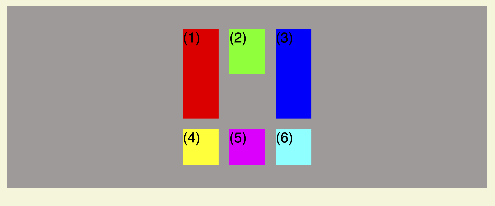
    - css for adusting the content inside the cell/one-item
      ```
      .container--2 {
        font-family: sans-serif;
        background-color: rgb(164, 155, 155);
        font-size: 40px;
        margin: 40px;
        display: grid;
        grid-template-columns: repeat(3, 100px);
        grid-template-rows: 250px 100px;
        row-gap: 30px;
        column-gap: 30px;
        padding: 5px;
        height: 500px;
        justify-content: center;
        align-content: center;
        overflow-y: auto;
        /* across-y-axis */
        align-items: center;
        /* across-x-axis */
        justify-items: center;
      }
      ```
      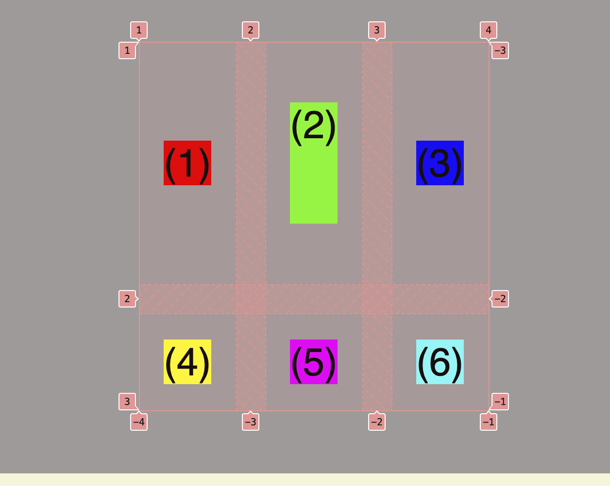
