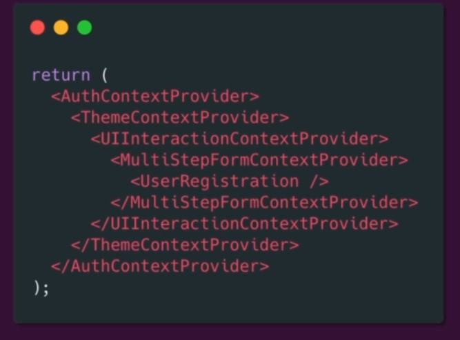
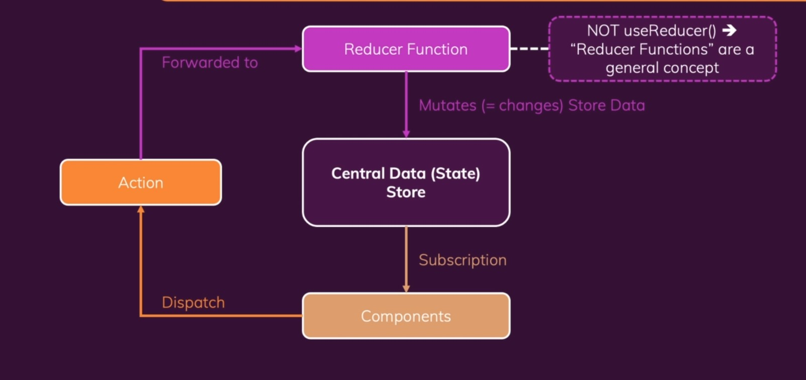

### Redux
- Types of states
  - Local
    - For single component
  - Cross Component
  - App Wide State
- React context and Resux solves the same problem of pasing data from one component to another across aplication and not necessary that components are having parent child relationship
  - Then what is the difference between **Redux** and **context**?
    - In **context** you might have to wrap your components one inside another and at the end you might get confused which component is sending/sharing the state. There will be deeply nested JSX code.
    - 
- How Redux Works
  - 
  - We have central **redux-store** which has all the data.
  - **Components** subscribes to the store.
  - **Reducers** changes/mutates the store
    - **reducers** always has two paramters and should return state. First param = old state, Second param = dispatched action. A reducer fuction should be a **pure function**.
  - **Components** dispatches the **actions** which in turn contacts with the reducers and reducers on the basics of **actions** will change the **store** or we can say change the **state**.